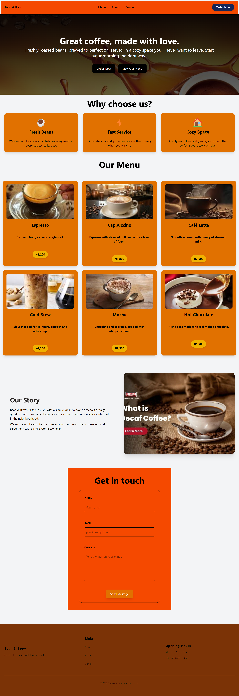

# ☕ Bean & Brew - Responsive Restaurant Landing Page

<p align="center">
  
  
  
</p>

A modern, responsive restaurant landing page built with **HTML5** and **Tailwind CSS**. This project focuses on creating a clean, accessible, and mobile-first user interface using **Tailwind utility classes only**, without writing custom CSS.

The goal was to demonstrate proficiency in responsive layouts, semantic HTML, and Tailwind CSS while following strict styling constraints.

---

#  Preview


<p align="center">
  
</p>

---

# Project Objectives

This project was built to demonstrate the ability to:

- Build responsive user interfaces with Tailwind CSS
- Apply mobile-first design principles
- Create reusable and maintainable layouts using utility classes
- Structure semantic HTML for accessibility and readability
- Design interfaces without writing custom CSS
- Follow real-world frontend development practices

---

# Features

- Responsive Navigation Bar
- Hero Section with Call-to-Action Buttons
- Responsive Feature Cards
- Restaurant Menu Cards
- About Section
- Contact Form
- Responsive Footer
- Hover Effects
- Rounded Cards
- Responsive Grid Layouts
- Mobile-first Design

---

# Technologies Used

| Technology | Purpose |
|------------|----------|
| HTML5 | Page Structure |
| Tailwind CSS | Styling |
| Flexbox | Layout |
| CSS Grid | Responsive Sections |
| Responsive Design | Mobile & Desktop Compatibility |

---

# Project Structure

```text
bean-brew/
│
├── img/
│   ├── hero.jpg
│   ├── espresso.jpg
│   ├── latte.jpg
│   ├── cappuccino.jpg
│   ├── cold-brew.jpg
│   ├── hot-chocolate.jpg
│   └── screenshot.png
│
├── src/
│   ├── input.css
│   └── output.css
│
├── tailwind-assignment.html
├── package.json
├── package-lock.json
└── README.md
```

---

# 📱 Responsive Design

This project follows a **mobile-first** approach using Tailwind's responsive breakpoint system.

### Breakpoints Used

```html
sm:
md:
lg:
```

Examples include:

- Responsive Navigation
- Grid Layouts
- Responsive Footer
- Contact Form
- Feature Cards
- About Section

---

# 🧠 Tailwind CSS Concepts Applied

Throughout this project, the following Tailwind utility classes were used:

### Layout

- Flexbox
- Grid
- Container
- Gap
- Space Utilities

### Typography

- Font Weight
- Font Size
- Text Alignment
- Text Color

### Spacing

- Margin
- Padding

### Sizing

- Width
- Height
- Max Width

### Backgrounds

- Background Images
- Background Colors
- Background Gradients

### Borders

- Rounded Corners
- Border Utilities

### Effects

- Hover States
- Shadows
- Focus Rings
- Smooth Transitions

### Responsiveness

- `sm:`
- `md:`
- `lg:`

---

# 📚 What I Learned

Working on this project strengthened my understanding of:

- Utility-first CSS with Tailwind
- Responsive web design
- Flexbox vs CSS Grid
- Mobile-first development
- Building clean UI without custom CSS
- Semantic HTML structure
- Organizing frontend projects
- Designing reusable layouts

---

# ⚡ Challenges

Some of the challenges encountered during development included:

- Designing layouts that adapt gracefully across different screen sizes.
- Structuring responsive grids without writing custom CSS.
- Creating visually balanced spacing using only Tailwind utilities.
- Styling forms and interactive components while maintaining accessibility.
- Building a consistent design system using reusable utility classes.

These challenges helped reinforce best practices for responsive frontend development.

---

# 💡 Future Improvements

- Dark Mode
- Animation with Tailwind
- Interactive Mobile Menu
- Online Reservation Form
- Menu Search & Filtering
- Backend Integration
- Deployment with CI/CD

---

# ▶️ Getting Started

Clone the repository

```bash
git clone https://github.com/yourusername/bean-brew.git
```

Navigate into the project

```bash
cd bean-brew
```

Install dependencies

```bash
npm install
```

Start Tailwind CSS

```bash
npx @tailwindcss/cli -i ./src/input.css -o ./src/output.css --watch
```

Open the project in your browser.

---

# Assignment Requirements Covered

- ✅ Responsive Navigation
- ✅ Hero Section
- ✅ Feature Cards
- ✅ Responsive Menu Grid
- ✅ About Section
- ✅ Contact Form
- ✅ Responsive Footer
- ✅ Mobile-first Design
- ✅ Tailwind Utility Classes Only
- ✅ No Custom CSS

---

# 👩‍💻 About Me

Hi, I'm **Rita Nnenna**.

I'm a Software Engineer focused on building responsive, user-friendly web applications and continuously improving my frontend and full-stack development skills.

I enjoy turning ideas into clean, maintainable, and accessible user interfaces while following modern development best practices.

---

# 🤝 Connect With Me

- **GitHub:** https://github.com/Ritacloud23
- **LinkedIn:** https://linkedin.com/in/rita-nnenna

---

# ⭐ Support

If you found this project helpful, consider giving it a ⭐ on GitHub. It helps others discover the project and supports my learning journey.

---

<p align="center">
Made with ❤️ using HTML5 & Tailwind CSS
</p>